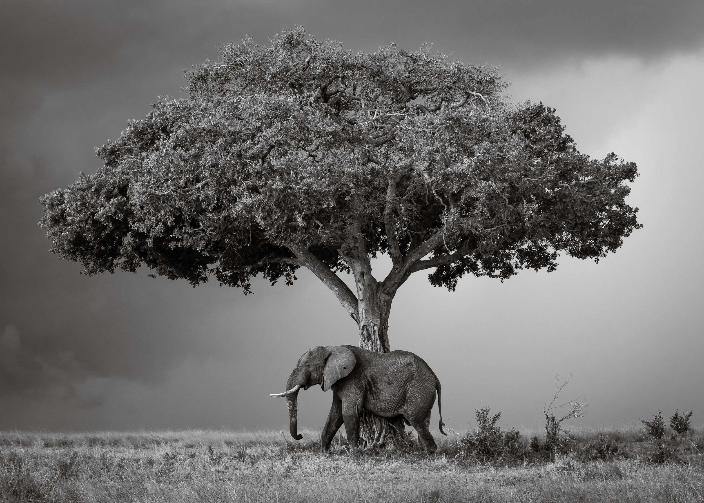
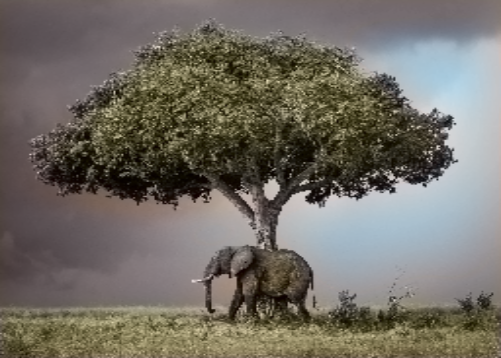

# 🎨 Image Colorizer

A deep learning model that automatically colorizes grayscale images using a CNN encoder-decoder architecture in the CIELAB color space. Built with **PyTorch** and optimized for **NVIDIA GPU acceleration**.


---

## 📖 Table of Contents

- [How It Works](#-how-it-works)
- [Project Structure](#-project-structure)
- [Model Architecture](#-model-architecture)
- [Prerequisites](#-prerequisites)
- [Installation](#-installation)
- [Training](#-training)
- [Colorizing Images](#-colorizing-images)
- [Sample Results](#-sample-results)
- [GPU Optimizations](#-gpu-optimizations)
- [Configuration](#%EF%B8%8F-configuration)
- [License](#-license)

---

## 🧠 How It Works

Traditional images use **RGB** (Red, Green, Blue) channels. This model works in the **CIELAB color space** instead, which separates an image into:

| Channel | What It Represents | Range |
|---------|-------------------|-------|
| **L** (Lightness) | Grayscale intensity | `0` (black) → `100` (white) |
| **a** | Green ↔ Red axis | `-128` → `+127` |
| **b** | Blue ↔ Yellow axis | `-128` → `+127` |

**The key insight:** The **L channel is the grayscale image** itself. The model's job is to predict the missing **a** and **b** color channels from the L channel alone.

### Pipeline Overview

```
┌─────────────┐     ┌──────────────┐     ┌─────────────┐     ┌──────────────┐
│  RGB Image  │────▶│  Convert to  │────▶│  Extract L   │────▶│   CNN Model  │
│  (input)    │     │  CIELAB      │     │  (grayscale) │     │  predicts ab │
└─────────────┘     └──────────────┘     └─────────────┘     └──────┬───────┘
                                                                    │
┌─────────────┐     ┌──────────────┐     ┌──────────────┐          │
│  Colorized  │◀────│  Convert to  │◀────│  Merge L+ab  │◀─────────┘
│  Output!    │     │  RGB         │     │  channels    │
└─────────────┘     └──────────────┘     └──────────────┘
```

---

## 📁 Project Structure

```
image-colorizer/
├── main/
│   ├── train_model.py        # Training pipeline (GPU-accelerated)
│   └── predict.py            # Colorize any grayscale image
├── model/
│   ├── architecture.py       # CNN encoder-decoder network definition
│   └── __init__.py
├── data/
│   ├── image_load/
│   │   └── load_image.py     # Scans dataset directory for images
│   ├── image_preprocess/
│   │   └── preprocess_image.py  # RGB → LAB conversion & normalization
│   └── __init__.py
├── samples/                  # Input/output sample images
│   ├── home-bw-00034.webp
│   └── colorized_home-bw-00034.webp
├── dataset/                  # Auto-downloaded COCO val2017 (gitignored)
├── checkpoints/              # Saved model weights (gitignored)
├── requirements.txt
├── .gitignore
└── README.md
```

---

## 🏗 Model Architecture

The model is a **3-level encoder-decoder CNN** with **1,155,714 trainable parameters**.

```
Input: L channel (1, 256, 256)
        │
        ▼
┌─ Encoder Block 1 ─────────────────┐
│  Conv2d(1→32) → BN → ReLU         │
│  Conv2d(32→32) → BN → ReLU        │
│  MaxPool2d(2×2)                    │  128×128
└────────────────────────────────────┘
        │
┌─ Encoder Block 2 ─────────────────┐
│  Conv2d(32→64) → BN → ReLU        │
│  Conv2d(64→64) → BN → ReLU        │
│  MaxPool2d(2×2)                    │  64×64
└────────────────────────────────────┘
        │
┌─ Encoder Block 3 ─────────────────┐
│  Conv2d(64→128) → BN → ReLU       │
│  Conv2d(128→128) → BN → ReLU      │
│  MaxPool2d(2×2)                    │  32×32
└────────────────────────────────────┘
        │
┌─ Bottleneck ───────────────────────┐
│  Conv2d(128→256) → BN → ReLU      │  32×32
└────────────────────────────────────┘
        │
┌─ Decoder Block 1 ─────────────────┐
│  Upsample(2×)                      │
│  Conv2d(256→128) → BN → ReLU      │
│  Conv2d(128→128) → BN → ReLU      │  64×64
└────────────────────────────────────┘
        │
┌─ Decoder Block 2 ─────────────────┐
│  Upsample(2×)                      │
│  Conv2d(128→64) → BN → ReLU       │
│  Conv2d(64→64) → BN → ReLU        │  128×128
└────────────────────────────────────┘
        │
┌─ Decoder Block 3 ─────────────────┐
│  Upsample(2×)                      │
│  Conv2d(64→32) → BN → ReLU        │  256×256
└────────────────────────────────────┘
        │
┌─ Output Layer ─────────────────────┐
│  Conv2d(32→2, 1×1) → Tanh         │
└────────────────────────────────────┘
        │
        ▼
Output: ab channels (2, 256, 256)    Range: [-1, 1]
```

**Key design choices:**
- **Tanh activation** on output → constrains predictions to `[-1, 1]`, matching the normalized `ab` channel range
- **BatchNorm** after every conv layer → stabilizes training and allows higher learning rates  
- **L channel normalized** internally by the model (`L / 100.0`) → keeps preprocessing simple

---

## ✅ Prerequisites

| Requirement | Minimum | Recommended |
|-------------|---------|-------------|
| **Python** | 3.10+ | 3.12 or 3.13 |
| **GPU** | Any CUDA-compatible NVIDIA GPU | RTX 30/40 series |
| **VRAM** | 4 GB | 8 GB+ |
| **RAM** | 8 GB | 16 GB+ |
| **Disk** | 2 GB free (for dataset) | 5 GB+ |
| **OS** | Windows 10/11 or Linux | — |

---

## 🚀 Installation

### 1. Clone the repository

```bash
git clone https://github.com/Ananthannn/image-colorizer.git
cd image-colorizer
```

### 2. Create a virtual environment

```bash
python -m venv venv
```

**Activate it:**

```bash
# Windows (PowerShell)
.\venv\Scripts\Activate

# Linux / macOS
source venv/bin/activate
```

### 3. Install PyTorch with CUDA support

> ⚠️ **Important:** Install PyTorch from the official index to get GPU support. Do NOT use plain `pip install torch`.

```bash
pip install torch torchvision torchaudio --index-url https://download.pytorch.org/whl/cu124
```

For other CUDA versions, check [pytorch.org/get-started](https://pytorch.org/get-started/locally/).

### 4. Install remaining dependencies

```bash
pip install opencv-python scikit-image numpy pillow scipy
```

### 5. Verify GPU detection

```bash
python -c "import torch; print('CUDA available:', torch.cuda.is_available()); print('GPU:', torch.cuda.get_device_name(0) if torch.cuda.is_available() else 'None')"
```

Expected output:
```
CUDA available: True
GPU: NVIDIA GeForce RTX 4060 Laptop GPU
```

---

## 🏋️ Training

### Quick Start

```bash
python main/train_model.py
```

That's it! The script will automatically:

1. **Download** the COCO 2017 Validation dataset (~800 MB) on first run
2. **Preprocess** 5,000 images into LAB color space
3. **Train** the model with GPU acceleration and mixed precision
4. **Save** the best model weights to `checkpoints/colorizer_weights.pth`

### Expected Training Output

```
🚀 Initializing PyTorch Colorizer Training pipeline...

🚀 GPU DETECTED: NVIDIA GeForce RTX 4060 Laptop GPU (8.0 GB VRAM)
   CUDA version: 12.4
   cuDNN enabled: True
   cuDNN benchmark: ENABLED ✅
   Mixed Precision (FP16): ENABLED ✅ — using tensor cores for ~2× speed

📂 Dataset ready at: ...\dataset\val2017
Pre-processing Images into PyTorch tensors...
Found 5000 images. Loading...
Dataset shape: X=(5000, 256, 256, 1), Y=(5000, 256, 256, 2)
📊 GPU memory used by model: 4 MB
🔥 Starting Training for 10 Epochs on CUDA...

  Epoch [1/10]  finished in 38.5s | Avg Loss: 0.0139 | Avg MAE: 0.0784
  Epoch [2/10]  finished in 29.9s | Avg Loss: 0.0128 | Avg MAE: 0.0754
  ...
  Epoch [10/10] finished in 29.4s | Avg Loss: 0.0122 | Avg MAE: 0.0740

🏁 Training Complete!
```

### Training Performance

| GPU | Time per Epoch | Total (10 epochs) |
|-----|---------------|-------------------|
| RTX 4060 Laptop | ~30s | ~5 min |
| RTX 3060 | ~35s | ~6 min |
| CPU only | ~5-10 min | ~1-2 hours |

---

## 🎨 Colorizing Images

After training, use the prediction script to colorize any grayscale image:

```bash
python main/predict.py "path/to/your/grayscale_image.jpg"
```

### Options

```bash
# Use default weights (checkpoints/colorizer_weights.pth)
python main/predict.py "photo.jpg"

# Specify custom weights path
python main/predict.py "photo.jpg" --weights "path/to/custom_weights.pth"
```

### Output

The colorized image is saved in the current directory as `colorized_<original_filename>`:

```
Loading image from 'photo.jpg'...
🎨 Colorizing image dynamically on CUDA...
Merging generated colors back together...
✅ Masterpiece Created! Painted image saved as: 'colorized_photo.jpg'
```

> **💡 Tip:** The model accepts any image — it doesn't have to be grayscale. Color images are automatically converted to grayscale (L channel) before colorization.

---

## 🖼 Sample Results

Here's a real example showing what the model can do — a grayscale photograph colorized by the trained network:

<table>
  <tr>
    <th>Input (Grayscale)</th>
    <th>Output (Colorized)</th>
  </tr>
  <tr>
    <td></td>
    <td></td>
  </tr>
</table>

> The model adds natural greens to the foliage and grass, warm earth tones to the elephant, and blue hues to the sky — all from a single grayscale input.

---

## ⚡ GPU Optimizations

This project includes several optimizations for maximum GPU throughput:

| Optimization | What It Does | Speedup |
|-------------|-------------|---------|
| **AMP (Mixed Precision)** | Uses FP16 on tensor cores, FP32 for stability | ~2× |
| **cuDNN Benchmark** | Auto-tunes convolution algorithms for your GPU | ~10-20% |
| **Pinned Memory** | Pre-stages data in page-locked RAM for faster transfer | ~5-10% |
| **Non-blocking Transfers** | Overlaps CPU↔GPU data movement with computation | ~5% |
| **Parallel Data Loading** | 4 worker threads load batches in the background | ~15% |
| **Efficient Gradient Clearing** | `set_to_none=True` avoids unnecessary memset | ~2% |

---

## ⚙️ Configuration

Training hyperparameters can be adjusted in `main/train_model.py`:

```python
batch_size = 16       # Increase if you have more VRAM (32 for 12GB+)
epochs = 10           # More epochs = better results (50-100 for best quality)
learning_rate = 1e-3  # Adam optimizer learning rate
```

Image processing settings:

```python
files_subset = files[:5000]   # Number of training images (max ~5000 for 16GB RAM)
image_size = 256              # All images resized to 256×256
```

---

## 📄 License

This project is licensed under the MIT License — see the [LICENSE](LICENSE) file for details.

---

<p align="center">
  Built with ❤️ using PyTorch and CUDA
</p>
